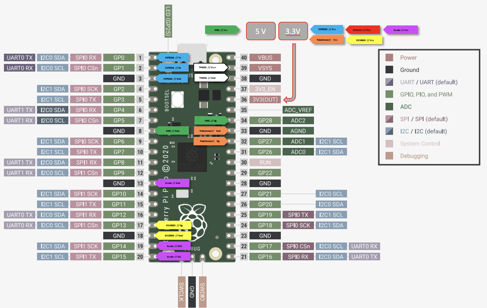

# Proyectos2

## Objectives:
- Electronic wireless system to collect physiological data from a patient and to deliver it to a server.
- Wireless. (without data cable or power cable)
- Low Cost.
- Small dimensions. 
- Show the information collected in the server.

## Steps: 
[Steps.md](https://github.com/bermejo4/Proyectos2/blob/main/Steps.md)

## Costs:
[Costs.md](https://github.com/bermejo4/Proyectos2/blob/main/Costs.md)

## Comparation between Raspberry Pico and Arduino Nano:
[ComparationBetween_RaspPico_ArduNano.md](https://github.com/bermejo4/Proyectos2/blob/main/ComparationBetween_RaspPico_ArduNano.md)

## Pins-modules diagram:

## Micropython code running on the Raspberry Pico:
[Pulse.py](https://github.com/bermejo4/Proyectos2/blob/main/micropython/pulse.py)

## Server code:
[Servidor/main.py ](https://github.com/bermejo4/Proyectos2/blob/main/Servidor/main.py)

